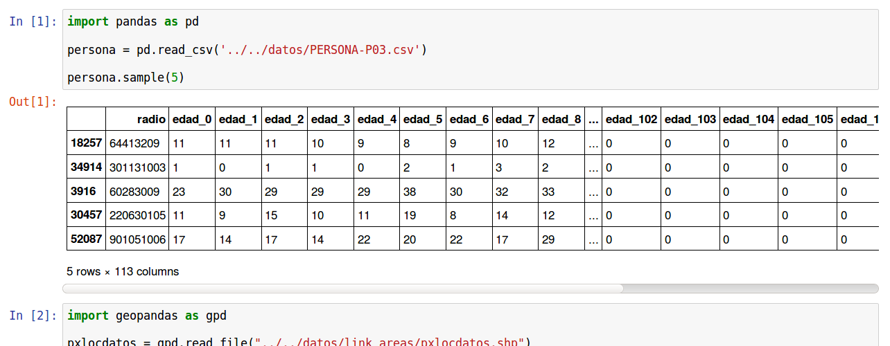
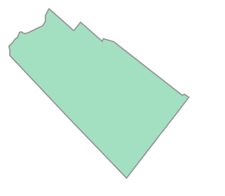
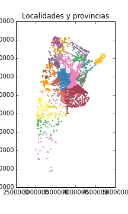

Intro: Jupyter notebooks, Pandas DataFrames, y GIS
==================================================

Jupyter Notebook es una poderosa herramienta que permite a los usuarios de Python crear y compartir documentos que contengan código en vivo, visualizaciones, textos explicativos y ecuaciones. El término "notebook" se refiere a que la herramienta Jupyter te permite escribir fragmentos de código ejecutable autónomo (las "celdas"), anotar cada procedimiento e incluso visualizar los datos con los que está trabajando en cualquier paso del camino.

**¿Por qué debería usar un Jupyter Notebook?**

Jupyter Notebook ha ganado enorme popularidad en la comunidad de Python data science en los últimos años por una variedad de razones. Segun el usuario de GIS `Alberto Nieto <https://blogs.esri.com/esri/arcgis/author/Alberto-149/>`_, Jupyter Notebook es extremadamente útil porque: 

**Permite probar lineas 'borrador' de codigo**

Los Jupyter notebooks son extremadamente útiles cuando no hay un proceso final definido y aún estamos en la fase de creación de prototipos (o sea probando que cosas podrian funcionar, o no). Esto se debe principalmente a que el código se escribe en celdas independientes, que pueden ejecutarse independientemente del resto del Ecódigo. Esto nos permite probar rápidamente un paso específico sin volver a ejecutar el código desde el comienzo cada vez.

**La visualización de Dataframes Pandas**

**Pandas** (Python Data Analysis Library) proporciona estructuras de datos (tablas, etc) de alto rendimiento y fáciles de usar que te permiten trabajar con gran cantidad de datos extremadamente rápido. El objeto de datos principal es un Dataframe, que es esencialmente una tabla en memoria que permite operaciones muy potentes, como vamos a ver.

Jupyter Notebook te permite visualizar estas tablas en cualquier punto de su computadora portátil. Esto es extremadamente útil porque podes ver el estado de tus datos (y el resultado de cada accion del código sobre los datos) al ejecutar cada paso.

Pandas nos permite combinar tablas, hacer operaciones en las filas y columnas, agrupar segun los valores en algunas columnas y hacer operaciones. En fin, **nos permite hacer y deshacer lo que se nos ocurra con las tablas de datos**. 

Manos a la obra! Datos Censo 2010 (Indec)
-----------------------------------------
**Poblacion por edad y radio censal. Censo 2010**

Vamos a bajar y extraer el archivo `PERSONA-P03.csv` de la `carpeta de datos <https://github.com/matuteiglesias/tutorial-datos-argentinos/tree/master/datos>`_ contiene informacion recopilada del Censo Nac. de Hogares y viviendas 2010. En este caso, poder tener la informacion en un formato tan conveniente se lo debemos a Manuel Aristaran, que `colgo <http://dump.jazzido.com/CNPHV2010-RADIO/>`_ los resultados de queries a la base de datos REDATAM en donde estan registrados los resultados del ultimo censo en Argentina.

En particular el archivo que tenemos aca tiene una columna con los codigos que identifican los radios censales, con el nombre 'link'. El resto de las columnas corresponden a cada edad posible en anios, de forma que cada fila puede tomarse como informacion de la piramide poblacional de un radio censal. Con este dataset podemos saber esencialmente cuanta gente de cada edad habia en cada lugar en octubre de 2010.

Vamos a cargarlo en un notebook de IPython:

.. ipython:: python

    import pandas as pd

    persona = pd.read_csv('datos/PERSONA-P03.csv')

    #Ahora ya tenemos guardado el dataset como un DataFrame de pandas.
    #Un dataframe tiene muchos metodos que nos sirven para interactuar con el. Por ejemplo, para ver una muestra de la data:
    persona.sample(5)

Geopandas
---------

Los ejemplos que voy a mostrar explotan no solo la data estadistica sino tambien la geografica. Notar que la clave del dataset persona que acabamos de cargar es que tenga un codigo identificatorio del area censal. Esto es esencial porque nos permite la combinacion con otros dataset que compartan esta columna, o bien que tengan una columna, por ejemplo 'provincia' o 'departamento' que se pueda combinar con la de los radios censales.

Hay un detalle que tambien hay que tener en cuenta. Cuando estamos en la capa geografica, mucha informacion puede naturalmente corresponder a puntos, lineas o poligonos (areas) en el espacio. Estamos habalndo por ejemplo de la ubicacion de edificios, el recorrido de lineas de transporte u otra infraestructura, o los limites de una provincia o distrito. La calidad de la informacion y de los analisis que podamos hacer va a ser infinitamente mayor si contamos con esta informacion de manera exacta.

Para este tipo de informacion, hay formatos especiales de archivos. Las alternativas son muchas, pero una bastante standard es usar archivos ShapeFile (.shp). El archivo .shp viene siempre acompaniado de otros archivos con informacion necesaria como aclaraciones de los sistemas de coordenadas, entre otras cosas.

En una terminal (ubicarse en el directorio donde)

.. code:: bash

   $ unzip datos.zip
   $ cd datos/link_areas/.shp
   $ ls
   metadatos shape pxlocdatos.pdf  nota aclaratoria.pdf  pxlocdatos.cpg  
   pxlocdatos.dbf  pxlocdatos.prj  pxlocdatos.qpj  pxlocdatos.shp  pxlocdatos.shx  Thumbs.db

Ahora vamos a usar el modulo geopandas, que esencialmente es lo mismo que pandas, con la posibilidad de incluir formas geometricas (puntos, lineas, poligonos) y hacer operaciones con ellos.

**Coordinate reference system (CRS)**

Un GeoDataFrame que se lee de un ShapeFile contiene por lo general informacion sobre el sistema de coordenadas en el cual esta proyectada la data.

Empecemos leyendo la data del archivo ``pxlocdatos.shp``.

.. ipython:: python

    import geopandas as gpd
    
    # Leer data
    pxlocdatos = gpd.read_file("datos/link_areas/pxlocdatos.shp")
    
    # Muestra de la data
    pxlocdatos.sample(3)

Al igual que en un DataFrame corriente de pandas, podemos por ejemplo preguntar cuales son las columnas de esta tabla:

.. ipython:: python

    pxlocdatos.columns

Podemos ver el sistema de referencia con el atributo ``.crs``:

.. ipython:: python

    pxlocdatos.crs

Informacion sobre los sistemas de coordenadas se puede encontrar en:

  - `www.spatialreference.org <http://spatialreference.org/>`__
  - `www.proj4.org <http://proj4.org/projections/index.html>`__
  - `www.mapref.org <http://mapref.org/CollectionofCRSinEurope.html>`__

Para obtener datos de las formas geometricas de las localidades vamos a cargar los archivos shape pertenecientes a la Provincia de Buenos Aires y la Ciudad de Buenos Aires (CABA).

.. ipython:: python

    Buenos_Aires_datos = gpd.read_file("datos/Buenos Aires/Buenos_Aires_con_datos.shp")
    
    Buenos_Aires_datos.sample(5)

Fijense que hay una columna que se llama ``geometry``. En general la informacion especial de los objetos va a ir a para a esta columna. en el caso de la tabla 'pxlocdatos' los elementos son instancias de shapely.Point. Estan describiendo probablemente un centroide del radio censal. El dataset de la Provincia si tiene formas geometricas, ver por ejemplo lo que pasa cuando hacemos:

.. ipython:: python

    Buenos_Aires_datos['geometry'][10]

Que nos grafica el area de la fila 10 con un dibujito.

Los GeoDataFrames permiten usar toda la funcionalidad de los DataFrames de pandas. Por ejemplo, podemos crear nuevas columnas con codigos de provincia y departamento (partido/comuna) y otra columna que se va a llamar 'dpto_link' que es una concatenacion del codigo de provincia y departamento, de forma de tener un codigo de departamento util a nivel nacional.
    
Como ultimo ejemplo podemos graficar las localidades en el espacio. Las coloreamos segun la provincia, para ilustrar una de las posibilidades.

.. ipython:: python
    
    #import the standard plotting module
    import matplotlib.pyplot as plt

    # create subplots
    f, ax = plt.subplots(1, figsize=(3, 5))

    pxlocdatos.plot(ax = ax, column = 'codpcia', edgecolor = 'None', marker = '.')
       
    # Add title
    plt.title('Localidades y provincias');

    # Remove empty white space around the plot
    plt.tight_layout()
    
    plt.show()
    

Los ejemplos mostrados aqui estan en el notebook 1_Geopandas.ipynb 
